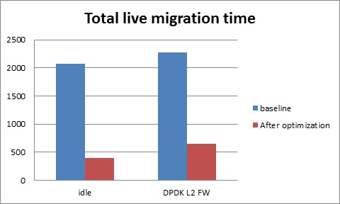

Fast Live migration
===================

The NFV project requires fast live migration. The specific requirement is total
live migration time < 2Sec, while keeping the VM down time < 10ms when running
DPDK L2 forwarding workload.

We measure the baseline data of migrating an idle 8GiB guest runs DPDK L2
forwarding work load, the total live migration time is 2271ms while VM downtime
is 26ms. Both of these two indicators can’t satisfy the requirement.

Current challenges
------------------

The performance of KVM live migration improved a lot these years, there are
some technics aim to make the live migration process faster, and some important
features include:

+ XBZRLE:
        It helps to reduce the network traffic by just transporting the
        compressed updated data.
+ RDMA:
        It uses specific NIC to increase the efficiency of data
        transportation.
+ Multi thread compression:
        It compresses the data before transportation.
+ Auto convergence:
        It reduces the VCPU time to reduce the data rate of dirty
        pages.

The test shows none of the above features can satisfy the requirement of NFV.
XBZRLE and Multi thread compression do the compression in pure software way,
they are not fast enough in 10Gbps network environment. RDMA is not flexible
because it has to transport all the guest memory to destination without zero
page optimization. Auto convergence is not appropriate for NFV because it will
impact guest’s performance.

So we need to find other ways for optimization.

Optimization we have done
-------------------------
a. Delay the non-emergency operations
   By profiling, we found some of the cleanup operation during the stop and
   copy stage is the main reason for the long VM down time, the cleanup operation
   includes stop the dirty page logging, which is a time consuming operation, by
   deferring these operation to all the data transportation completed, we can
   reduce the VM down time to about 5~7ms.
b. Optimize zero page checking
   Current QEMU use the SSE2 instruction to optimize the zero pages checking,
   the SSE2 instruction can process 16 bytes per instruction. By using the AVX2
   instruction, we can process 32 bytes per instruction. The test shows using AVX2
   can speed up the zero pages checking process by about 25%.
c. Fix some time consuming issue
   There is an issue which synchronizes the CPU context twice during live
   migration. We fix it and shorten the VM downtime about 100us.

Test environment
----------------

The source and destination host have the same hardware and OS:
::
Host: HSW-EP
CPU: Intel(R) Xeon(R) CPU E5-2699 v3 @ 2.30GHz
RAM: 64G
OS: RHEL 7.1
Kernel: 4.2
QEMU v2.4.0

Ethernet controller: Intel Corporation Ethernet Controller 10-Gigabit X540-AT2 (rev 01)
QEMU parameters:
::
  /root/qemu.git/x86_64-softmmu/qemu-system-x86_64-enable-kvm -cpu host -smp 4 –device virtio-net-pci,netdev=net1,mac=52:54:00:12:34:56 –netdev type=tap,id=net1,script=/etc/kvm/qemu-ifup,downscript=no,vhost=on–device virtio-net-pci,netdev=net2,mac=54:54:00:12:34:56 –netdevtype=tap,id=net2,script=/etc/kvm/qemu-ifup2,downscript=no,vhost=on  -balloon virtio -m 8192-monitor stdio  /mnt/liang/ia32e_rhel6u5.qcow

Network connection

.. figure:: lmnetwork.jpg
   :align: center
   :alt: live migration network connection
   :figwidth: 80%

Test Result
-----------
The down time is set to 10ms when doing the test. We use pktgen to send the
packages to guest, the package size is 64 bytes, and the line rate is 2013
Mbps.

a. Total live migration time

   The total live migration time before and after optimization is showed in the
   chart below. For an idle guest, we can reduce the total live migration time
   from 2070ms to 401ms. For guest runs the DPDK L2 forwarding workload, the total
   live migration time is reduced from 2271ms to 654ms.

b. VM downtime

   The VM down time before and after optimization is showed in the chart below.
   For an idle guest, we can reduce the VM down time from 29ms to 9ms. For guest
   runs the DPDK L2 forwarding workload, the VM down time is reduced from 26ms to
   5ms.

