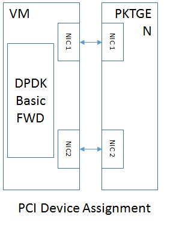

.. This work is licensed under a Creative Commons Attribution 4.0 International License.
.. http://creativecommons.org/licenses/by/4.0
.. (c) <optionally add copywriters name>

Low Latency Network Test Environment Setup
==========================================

On :doc:`environment-setup`, the steps to setup generic low latency environment
is described, covering the Hardware, BIOS and kernel.

To setup a low latency NFV environment is more than that. The network related components like
virtual switch is also needed. This document covers these NFV specific
enviornment.

SR-IOV Enviornment Description
------------------------------

One usual NFV scenario is to assign a SR-IOV device to a VNF and the network
function can achieve near baremetal throughput and latency with the SR-IOV
device.

Enviornment setup

On the example SR-IOV enviornment, one host is connected to traffic generator
through two NICs. The packet is received from NIC1 and received by the VM. The
DPDK packet forward application, as an NF, forwards the packet to NIC2. The
packet is received by the traffic generator in the end.

There are several choices of packet forward applications like basicfwd
(http://dpdk.org/doc/guides/sample_app_ug/skeleton.html) or l2 forward
(http://dpdk.org/doc/guides/sample_app_ug/l2_forward_real_virtual.html), or l3
forward(http://dpdk.org/doc/guides-16.04/sample_app_ug/l3_forward.html). The
basicfwd will be the test case used by the KVM4NFV project.

Special care should be taken for the environment, below are some experience
sharing.

NUMA setup:
::
The VM should be hosted on the same NUMA node as the NIC devices and the memory
for the VM should come from the same NUMA node. This avoid cross-numa-node
access and avoid latency.

Quite mode:
::
By default, the basicfwd applications and the DPDK library will show some
performance data, for information and stastic purpose. Such information is
helpful for throughput test. However, this will bring extra latency, thus we
should disable it through -t.

Batch mode:
::
To reduce the context switch on packet handling and achieve high throughput,
network function may fetch the patcket in batch mode, i.e. they will try to
fetch the 32 packets in on access. This optimization may bring extra latency
also. Basicfwd does not use such batch mode while l2fwd application does use it.

Packet flow:
::
Currently KVM4NFV team focus on one-way packet flow. Traffic generator only send
packet to NIC1 and the packet is forwarded to NIC2, i.e. the NIC1 has only
in-flow while NIC2 has only out-flow. Although in real environment, two-way
packet flow is more common, but KVM4NFV project focus on the one-way flow now.

Virtual NIC:
::
Other than the two physical NICs assigned to the VNF for packet processing,
another virtual device may be used to access and manage the VNF. Please be sure
to use virtio virtual NIC, instead of virtual E1000 NIC card. The virtual E1000
NIC card trigger the interrupt through virtual IOAPIC, which will cause huge
latency.
