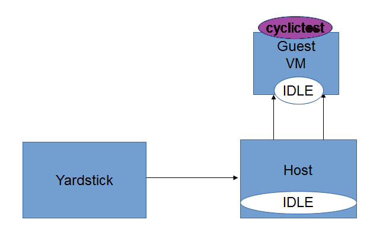
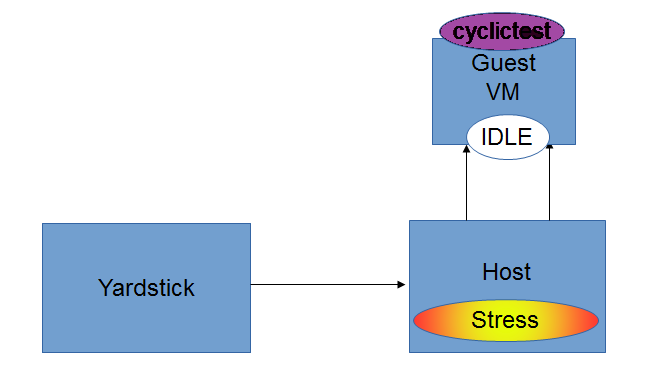

.. This work is licensed under a Creative Commons Attribution 4.0 International License.
.. http://creativecommons.org/licenses/by/4.0

=============================================
Low Latency Feature Configuration Description
=============================================

Introduction
--------------
In KVM4NFV project, we focus on the KVM hypervisor to enhance it for NFV, by
looking at the following areas initially

* Minimal Interrupt latency variation for data plane VNFs:
   * Minimal Timing Variation for Timing correctness of real-time VNFs
   * Minimal packet latency variation for data-plane VNFs
* Inter-VM communication,
* Fast live migration

Configuration of Cyclictest
----------------------------

Cyclictest measures Latency of response to a stimulus. Achieving low latency
with the KVM4NFV project requires setting up a special test environment.
This environment includes the BIOS settings, kernel configuration, kernel
parameters and the run-time environment.

* For more information regarding the test environment, please visit
  https://wiki.opnfv.org/display/kvm/KVM4NFV+Test++Environment
  https://wiki.opnfv.org/display/kvm/Nfv-kvm-tuning

Pre-configuration activities
~~~~~~~~~~~~~~~~~~~~~~~~~~~~~

Intel POD10 is currently used as OPNFV-KVM4NFV test environment. The latest
build packages are downloaded onto Intel Pod10-jump server from artifact
repository. Yardstick running in a ubuntu docker container on Intel Pod10-jump
server will trigger the cyclictest.

Running cyclictest through Yardstick will Configure the host(Pod1-node1), the
guest, executes cyclictest on the guest based on the below yaml files.

.. code:: bash

    For IDLE-IDLE test,

    host_setup_seqs:
    - "host-setup0.sh"
    - "reboot"
    - "host-setup1.sh"
    - "host-run-qemu.sh"

    guest_setup_seqs:
    - "guest-setup0.sh"
    - "reboot"
    - "guest-setup1.sh"

.. code:: bash

    For Stress-IDLE tests,

    host_setup_seqs:
    - "host-setup0.sh"
    - "reboot"
    - "host-setup1.sh"
    - "stress_daily.sh"
    - "host-run-qemu.sh"

    guest_setup_seqs:
    - "guest-setup0.sh"
    - "reboot"
    - "guest-setup1.sh"

The following scripts are used for configuring host and guest to create a
special test environment and achieve low latency.

Note: host-setup0.sh, host-setup1.sh and host-run-qemu.sh are run on the host,
followed by guest-setup0.sh and guest-setup1.sh scripts on the guest VM.

**host-setup0.sh**: Running this script will install the latest kernel rpm
on host and will make necessary changes as following to create special test
environment

   * Isolates CPUs from the general scheduler
   * Stops timer ticks on isolated CPUs whenever possible
   * Stops RCU callbacks on isolated CPUs
   * Enables intel iommu driver and disables DMA translation for devices
   * Sets HugeTLB pages to 1GB
   * Disables machine check
   * Disables clocksource verification at runtime

**host-setup1.sh**: Running this script will make the following test
environment changes

   * Disabling watchdogs to reduce overhead
   * Disabling RT throttling
   * Reroute interrupts bound to isolated CPUs to CPU 0
   * Change the iptable so that we can ssh to the guest remotely

**stress_daily.sh**: Scripts gets triggered only for stress-idle tests. Runnig this script
make the following environment changes

   * Triggers stress_script.sh, which runs the stress command with necessary options
   * CPU,Memory or IO stress can be applied based on the need
   * For D-Release stress is applied only on the Host
   * For Idle-Idle test the stress script is not triggered
   * Stress is applied only on the free cores to prevent load on qemu process

**host-run-qemu.sh**: Running this script will launch a guest vm on the host.
     Note: download guest disk image from artifactory

**guest-setup0.sh**: Running this scrcipt on the guest vm will install the
latest build kernel rpm, cyclictest and make the following configuration on
guest vm.

   * Isolates CPUs from the general scheduler
   * Stops timer ticks on isolated CPUs whenever possible
   * Uses polling idle loop to improve performance
   * Disables clocksource verification at runtime

**guest-setup1.sh**: Running this script on guest vm will do the following
configurations

   * Disable watchdogs to reduce overhead
   * Routes device interrupts to non-RT CPU
   * Disables RT throttling

Hardware configuration
~~~~~~~~~~~~~~~~~~~~~~

Currently Intel POD1 is used as test environment for kvmfornfv to execute
cyclictest. As part of this test environment Intel pod10-jump is configured as
jenkins slave and all the latest build artifacts are downloaded on to it.
Intel pod1-node1 is the host on which a guest vm will be launched as a part of
running cylictest through yardstick.

* For more information regarding hardware configuration, please visit
  https://wiki.opnfv.org/display/pharos/Intel+Pod10
  https://build.opnfv.org/ci/computer/intel-pod10/
  http://artifacts.opnfv.org/octopus/brahmaputra/docs/octopus_docs/opnfv-jenkins-slave-connection.html
