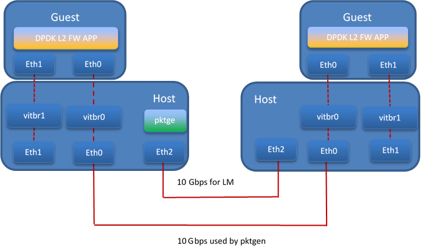
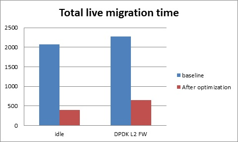
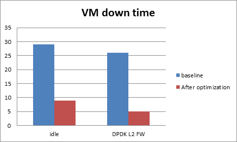

.. This work is licensed under a Creative Commons Attribution 4.0 International License.

.. http://creativecommons.org/licenses/by/4.0

Fast Live Migration
===================

The NFV project requires fast live migration. The specific requirement is
total live migration time < 2Sec, while keeping the VM down time < 10ms when
running DPDK L2 forwarding workload.

We measured the baseline data of migrating an idle 8GiB guest running a DPDK L2
forwarding work load and observed that the total live migration time was 2271ms
while the VM downtime was 26ms. Both of these two indicators failed to satisfy
the requirements.

Current Challenges
------------------

The following 4 features have been developed over the years to make the live
migration process faster.

+ XBZRLE:
        Helps to reduce the network traffic by just sending the
        compressed data.
+ RDMA:
        Uses a specific NIC to increase the efficiency of data
        transmission.
+ Multi thread compression:
        Compresses the data before transmission.
+ Auto convergence:
        Reduces the data rate of dirty pages.

Tests show none of the above features can satisfy the requirement of NFV.
XBZRLE and Multi thread compression do the compression entirely in software and
they are not fast enough in a 10Gbps network environment. RDMA is not flexible
because it has to transport all the guest memory to the destination without zero
page optimization. Auto convergence is not appropriate for NFV because it will
impact guest’s performance.

So we need to find other ways for optimization.

Optimizations
-------------------------
a. Delay non-emergency operations
   By profiling, it was discovered that some of the cleanup operations during
   the stop and copy stage are the main reason for the long VM down time. The
   cleanup operation includes stopping the dirty page logging, which is a time
   consuming operation. By deferring these operations until the data transmission
   is completed the VM down time is reduced to about 5-7ms.
b. Optimize zero page checking
   Currently QEMU uses the SSE2 instruction to optimize the zero pages
   checking.  The SSE2 instruction can process 16 bytes per instruction.
   By using the AVX2 instruction, we can process 32 bytes per instruction.
   Testing shows that using AVX2 can speed up the zero pages checking process
   by about 25%.
c. Remove unnecessary context synchronization.
   The CPU context was being synchronized twice during live migration. Removing
   this unnecessary synchronization shortened the VM downtime by about 100us.

Test Environment
----------------

The source and destination host have the same hardware and OS:
::
Host: HSW-EP
CPU: Intel(R) Xeon(R) CPU E5-2699 v3 @ 2.30GHz
RAM: 64G
OS: RHEL 7.1
Kernel: 4.2
QEMU v2.4.0

Ethernet controller: Intel Corporation Ethernet Controller 10-Gigabit
X540-AT2 (rev 01)
QEMU parameters:
::
${qemu} -smp ${guest_cpus} -monitor unix:${qmp_sock},server,nowait -daemonize \
-cpu host,migratable=off,+invtsc,+tsc-deadline,pmu=off \
-realtime mlock=on -mem-prealloc -enable-kvm -m 1G \
-mem-path /mnt/hugetlbfs-1g \
-drive file=/root/minimal-centos1.qcow2,cache=none,aio=threads \
-netdev user,id=guest0,hostfwd=tcp:5555-:22 \
-device virtio-net-pci,netdev=guest0 \
-nographic -serial /dev/null -parallel /dev/null

Network connection

Test Result
-----------
The down time is set to 10ms when doing the test. We use pktgen to send the
packages to guest, the package size is 64 bytes, and the line rate is 2013
Mbps.

a. Total live migration time

   The total live migration time before and after optimization is shown in the
   chart below. For an idle guest, we can reduce the total live migration time
   from 2070ms to 401ms. For a guest running the DPDK L2 forwarding workload,
   the total live migration time is reduced from 2271ms to 654ms.

b. VM downtime

   The VM down time before and after optimization is shown in the chart below.
   For an idle guest, we can reduce the VM down time from 29ms to 9ms. For a guest
   running the DPDK L2 forwarding workload, the VM down time is reduced from 26ms to
   5ms.

