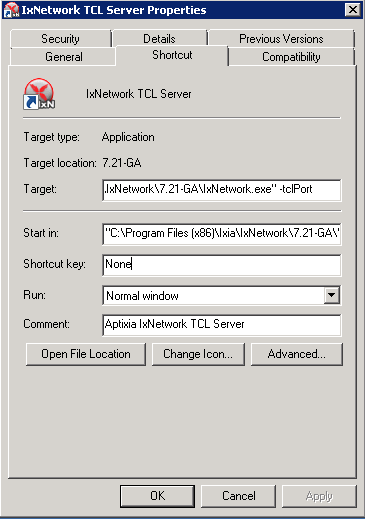
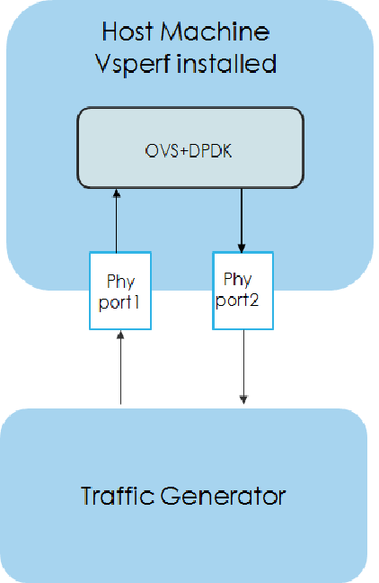
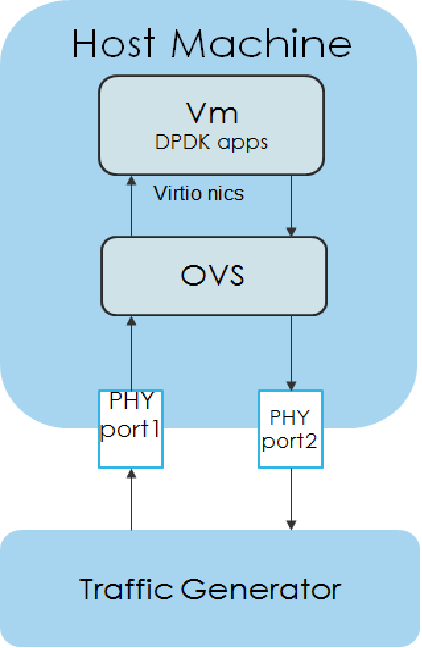
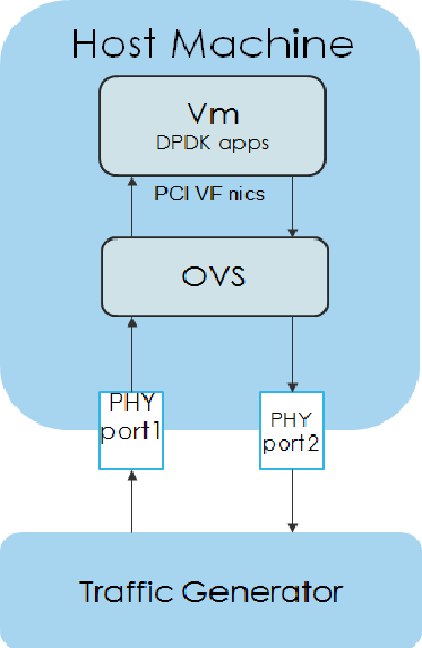

.. This work is licensed under a Creative Commons Attribution 4.0 International License.

.. http://creativecommons.org/licenses/by/4.0

=================
Packet Forwarding
=================

About Packet Forwarding
-----------------------

Packet Forwarding is a test suite of KVM4NFV. These latency tests measures the time taken by a
**Packet** generated by the traffic generator to travel from the originating device through the
network to the destination device. Packet Forwarding is implemented using test framework
implemented by OPNFV VSWITCHPERF project and an ``IXIA Traffic Generator``.

Version Features
----------------

+-----------------------------+---------------------------------------------------+
|                             |                                                   |
|      **Release**            |               **Features**                        |
|                             |                                                   |
+=============================+===================================================+
|                             | - Packet Forwarding is not part of Colorado       |
|       Colorado              |   release of KVM4NFV                              |
|                             |                                                   |
+-----------------------------+---------------------------------------------------+
|                             | - Packet Forwarding is a testcase in KVM4NFV      |
|                             | - Implements three scenarios (Host/Guest/SRIOV)   |
|                             |   as part of testing in KVM4NFV                   |
|       Danube                | - Uses automated test framework of OPNFV          |
|                             |   VSWITCHPERF software (PVP/PVVP)                 |
|                             | - Works with IXIA Traffic Generator               |
+-----------------------------+---------------------------------------------------+
|                             | - Test cases involving multiple guests (PVVP/PVPV)|
|                             |   included.                                       |
|       Euphrates             | - Implemented Yardstick Grafana dashboard to      |
|                             |   publish results of packet forwarding test cases |
+-----------------------------+---------------------------------------------------+

VSPERF
------

VSPerf is an OPNFV testing project.
VSPerf will develop a generic and architecture agnostic vSwitch testing framework and associated
tests, that will serve as a basis for validating the suitability of different vSwitch
implementations in a Telco NFV deployment environment. The output of this project will be utilized
by the OPNFV Performance and Test group and its associated projects, as part of OPNFV Platform and
VNF level testing and validation.

For complete VSPERF documentation go to `link.`_

.. _link.: http://artifacts.opnfv.org/vswitchperf/danube/index.html

Installation
~~~~~~~~~~~~

Guidelines of installating `VSPERF`_.

.. _VSPERF: http://artifacts.opnfv.org/vswitchperf/colorado/configguide/index.html

Supported Operating Systems
~~~~~~~~~~~~~~~~~~~~~~~~~~~

* CentOS 7
* Fedora 20
* Fedora 21
* Fedora 22
* RedHat 7.2
* Ubuntu 14.04

Supported vSwitches
~~~~~~~~~~~~~~~~~~~

The vSwitch must support Open Flow 1.3 or greater.

* OVS (built from source).
* OVS with DPDK (built from source).

Supported Hypervisors
~~~~~~~~~~~~~~~~~~~~~

* Qemu version 2.6.

Other Requirements
~~~~~~~~~~~~~~~~~~

The test suite requires Python 3.3 and relies on a number of other
packages. These need to be installed for the test suite to function.

Installation of required packages, preparation of Python 3 virtual
environment and compilation of OVS, DPDK and QEMU is performed by
script **systems/build_base_machine.sh**. It should be executed under
user account, which will be used for vsperf execution.

 **Please Note:** Password-less sudo access must be configured for given user before script is
executed.

Execution of installation script:

.. code:: bash

    $ cd vswitchperf
    $ cd systems
    $ ./build_base_machine.sh

Script **build_base_machine.sh** will install all the vsperf dependencies
in terms of system packages, Python 3.x and required Python modules.
In case of CentOS 7 it will install Python 3.3 from an additional repository
provided by Software Collections (`a link`_). In case of RedHat 7 it will
install Python 3.4 as an alternate installation in /usr/local/bin. Installation
script will also use `virtualenv`_ to create a vsperf virtual environment,
which is isolated from the default Python environment. This environment will
reside in a directory called **vsperfenv** in $HOME.

You will need to activate the virtual environment every time you start a
new shell session. Its activation is specific to your OS:

For running testcases VSPERF is installed on Intel pod1-node2 in which centos
operating system is installed. Only VSPERF installion on Centos is discussed here.
For installation steps on other operating systems please refer to `here`_.

.. _here: http://artifacts.opnfv.org/vswitchperf/colorado/configguide/index.html

For CentOS 7
~~~~~~~~~~~~~~

## Python 3 Packages

To avoid file permission errors and Python version issues, use virtualenv to create an isolated
environment with Python3. The required Python 3 packages can be found in the `requirements.txt` file
in the root of the test suite. They can be installed in your virtual environment like so:

.. code:: bash

   scl enable python33 bash
   # Create virtual environment
   virtualenv vsperfenv
   cd vsperfenv
   source bin/activate
   pip install -r requirements.txt

You need to activate the virtual environment every time you start a new shell session.
To activate, simple run:

.. code:: bash

   scl enable python33 bash
   cd vsperfenv
   source bin/activate

Working Behind a Proxy
~~~~~~~~~~~~~~~~~~~~~~

If you're behind a proxy, you'll likely want to configure this before running any of the above.
For example:

.. code:: bash

   export http_proxy="http://<username>:<password>@<proxy>:<port>/";
   export https_proxy="https://<username>:<password>@<proxy>:<port>/";
   export ftp_proxy="ftp://<username>:<password>@<proxy>:<port>/";
   export socks_proxy="socks://<username>:<password>@<proxy>:<port>/";

.. _a link: http://www.softwarecollections.org/en/scls/rhscl/python33/
.. _virtualenv: https://virtualenv.readthedocs.org/en/latest/

For other OS specific activation click `this link`_:

.. _this link:
http://artifacts.opnfv.org/vswitchperf/colorado/configguide/installation.html#other-requirements

Traffic-Generators
------------------

VSPERF supports many Traffic-generators. For configuring VSPERF to work with the available traffic
generator go through `this`_.

.. _this: http://artifacts.opnfv.org/vswitchperf/colorado/configguide/trafficgen.html

VSPERF supports the following traffic generators:

  * Dummy (DEFAULT): Allows you to use your own external
    traffic generator.
  * IXIA (IxNet and IxOS)
  * Spirent TestCenter
  * Xena Networks
  * MoonGen

To see the list of traffic gens from the cli:

.. code-block:: console

    $ ./vsperf --list-trafficgens

This guide provides the details of how to install
and configure the various traffic generators.

As KVM4NFV uses only IXIA traffic generator, it is discussed here. For complete documentation
regarding traffic generators please follow this `link`_.

.. _link: https://gerrit.opnfv.org/gerrit/gitweb?p=vswitchperf.git;a=blob;f=docs/configguide/trafficgen.rst;h=85fc35b886d30db3b92a6b7dcce7ca742b70cbdc;hb=HEAD

IXIA Setup
----------

Hardware Requirements
~~~~~~~~~~~~~~~~~~~~~

VSPERF requires the following hardware to run tests: IXIA traffic generator (IxNetwork), a machine
that runs the IXIA client software and a CentOS Linux release 7.1.1503 (Core) host.

Installation
~~~~~~~~~~~~

Follow the installation instructions to install.

On the CentOS 7 system
~~~~~~~~~~~~~~~~~~~~~~

You need to install IxNetworkTclClient$(VER_NUM)Linux.bin.tgz.

On the IXIA client software system
~~~~~~~~~~~~~~~~~~~~~~~~~~~~~~~~~~~

Find the IxNetwork TCL server app
  - (start -> All Programs -> IXIA -> IxNetwork -> IxNetwork_$(VER_NUM) -> IxNetwork TCL Server)
  - Right click on IxNetwork TCL Server, select properties
  - Under shortcut tab in the Target dialogue box make sure there is the argument "-tclport xxxx"

where xxxx is your port number (take note of this port number you will need it for the
10_custom.conf file).

- Hit Ok and start the TCL server application

VSPERF configuration
--------------------

There are several configuration options specific to the IxNetworks traffic generator
from IXIA. It is essential to set them correctly, before the VSPERF is executed
for the first time.

Detailed description of options follows:

 * TRAFFICGEN_IXNET_MACHINE - IP address of server, where IxNetwork TCL Server is running
 * TRAFFICGEN_IXNET_PORT - PORT, where IxNetwork TCL Server is accepting connections from
   TCL clients
 * TRAFFICGEN_IXNET_USER - username, which will be used during communication with IxNetwork
   TCL Server and IXIA chassis
 * TRAFFICGEN_IXIA_HOST - IP address of IXIA traffic generator chassis
 * TRAFFICGEN_IXIA_CARD - identification of card with dedicated ports at IXIA chassis
 * TRAFFICGEN_IXIA_PORT1 - identification of the first dedicated port at TRAFFICGEN_IXIA_CARD
   at IXIA chassis; VSPERF uses two separated ports for traffic generation. In case of
   unidirectional traffic, it is essential to correctly connect 1st IXIA port to the 1st NIC
   at DUT, i.e. to the first PCI handle from WHITELIST_NICS list. Otherwise traffic may not
   be able to pass through the vSwitch.
 * TRAFFICGEN_IXIA_PORT2 - identification of the second dedicated port at TRAFFICGEN_IXIA_CARD
   at IXIA chassis; VSPERF uses two separated ports for traffic generation. In case of
   unidirectional traffic, it is essential to correctly connect 2nd IXIA port to the 2nd NIC
   at DUT, i.e. to the second PCI handle from WHITELIST_NICS list. Otherwise traffic may not
   be able to pass through the vSwitch.
 * TRAFFICGEN_IXNET_LIB_PATH - path to the DUT specific installation of IxNetwork TCL API
 * TRAFFICGEN_IXNET_TCL_SCRIPT - name of the TCL script, which VSPERF will use for
   communication with IXIA TCL server
 * TRAFFICGEN_IXNET_TESTER_RESULT_DIR - folder accessible from IxNetwork TCL server,
   where test results are stored, e.g. ``c:/ixia_results``; see test-results-share_
 * TRAFFICGEN_IXNET_DUT_RESULT_DIR - directory accessible from the DUT, where test
   results from IxNetwork TCL server are stored, e.g. ``/mnt/ixia_results``; see
   test-results-share_

.. _test-results-share:

Test results share
~~~~~~~~~~~~~~~~~~

VSPERF is not able to retrieve test results via TCL API directly. Instead, all test
results are stored at IxNetwork TCL server. Results are stored at folder defined by
``TRAFFICGEN_IXNET_TESTER_RESULT_DIR`` configuration parameter. Content of this
folder must be shared (e.g. via samba protocol) between TCL Server and DUT, where
VSPERF is executed. VSPERF expects, that test results will be available at directory
configured by ``TRAFFICGEN_IXNET_DUT_RESULT_DIR`` configuration parameter.

Example of sharing configuration:

 * Create a new folder at IxNetwork TCL server machine, e.g. ``c:\ixia_results``
 * Modify sharing options of ``ixia_results`` folder to share it with everybody
 * Create a new directory at DUT, where shared directory with results
   will be mounted, e.g. ``/mnt/ixia_results``
 * Update your custom VSPERF configuration file as follows:

   .. code-block:: python

       TRAFFICGEN_IXNET_TESTER_RESULT_DIR = 'c:/ixia_results'
       TRAFFICGEN_IXNET_DUT_RESULT_DIR = '/mnt/ixia_results'

   Note: It is essential to use slashes '/' also in path
   configured by ``TRAFFICGEN_IXNET_TESTER_RESULT_DIR`` parameter.

* Install cifs-utils package.

   e.g. at rpm based Linux distribution:

.. code-block:: console

       yum install cifs-utils

* Mount shared directory, so VSPERF can access test results.

   e.g. by adding new record into ``/etc/fstab``

.. code-block:: console

       mount -t cifs //_TCL_SERVER_IP_OR_FQDN_/ixia_results /mnt/ixia_results
             -o file_mode=0777,dir_mode=0777,nounix

It is recommended to verify, that any new file inserted into ``c:/ixia_results`` folder
is visible at DUT inside ``/mnt/ixia_results`` directory.

Cloning and building src dependencies
~~~~~~~~~~~~~~~~~~~~~~~~~~~~~~~~~~~~~

In order to run VSPERF, you will need to download DPDK and OVS. You can do this manually and build
them in a preferred location, or you could use vswitchperf/src. The vswitchperf/src directory
contains makefiles that will allow you to clone and build the libraries that VSPERF depends on,
such as DPDK and OVS. To clone and build simply:

.. code:: bash

   cd src
   make

To delete a src subdirectory and its contents to allow you to re-clone simply use:

.. code:: bash

   make cleanse

Configure the `./conf/10_custom.conf` file
~~~~~~~~~~~~~~~~~~~~~~~~~~~~~~~~~~~~~~~~~~~

The supplied `10_custom.conf` file must be modified, as it contains configuration items for which
there are no reasonable default values.

The configuration items that can be added is not limited to the initial contents. Any configuration
item mentioned in any .conf file in `./conf` directory can be added and that item will be overridden
by the custom configuration value.

Using a custom settings file
~~~~~~~~~~~~~~~~~~~~~~~~~~~~~~~

Alternatively a custom settings file can be passed to `vsperf` via the `--conf-file` argument.

.. code:: bash

   ./vsperf --conf-file <path_to_settings_py> ...

Note that configuration passed in via the environment (`--load-env`) or via another command line
argument will override both the default and your custom configuration files. This
"priority hierarchy" can be described like so (1 = max priority):

1. Command line arguments
2. Environment variables
3. Configuration file(s)

vloop_vnf
~~~~~~~~~

VSPERF uses a VM image called vloop_vnf for looping traffic in the deployment
scenarios involving VMs. The image can be downloaded from
`<http://artifacts.opnfv.org/>`__.

Please see the installation instructions for information on :ref:`vloop-vnf`
images.

.. _l2fwd-module:

l2fwd Kernel Module
~~~~~~~~~~~~~~~~~~~

A Kernel Module that provides OSI Layer 2 Ipv4 termination or forwarding with
support for Destination Network Address Translation (DNAT) for both the MAC and
IP addresses. l2fwd can be found in <vswitchperf_dir>/src/l2fwd

Executing tests
~~~~~~~~~~~~~~~~

Before running any tests make sure you have root permissions by adding the following line to
/etc/sudoers:

.. code:: bash

   username ALL=(ALL)       NOPASSWD: ALL

username in the example above should be replaced with a real username.

To list the available tests:

.. code:: bash

   ./vsperf --list-tests

To run a group of tests, for example all tests with a name containing
'RFC2544':

.. code:: bash

   ./vsperf --conf-file=user_settings.py --tests="RFC2544"

To run all tests:

.. code:: bash

   ./vsperf --conf-file=user_settings.py

Some tests allow for configurable parameters, including test duration (in seconds) as well as packet
sizes (in bytes).

.. code:: bash

   ./vsperf --conf-file user_settings.py
       --tests RFC2544Tput
       --test-param` "rfc2544_duration=10;packet_sizes=128"

For all available options, check out the help dialog:

.. code:: bash

    ./vsperf --help

Testcases
----------

Available Tests in VSPERF are:

   * phy2phy_tput
   * phy2phy_forwarding
   * back2back
   * phy2phy_tput_mod_vlan
   * phy2phy_cont
   * pvp_cont
   * pvvp_cont
   * pvpv_cont
   * phy2phy_scalability
   * pvp_tput
   * pvp_back2back
   * pvvp_tput
   * pvvp_back2back
   * phy2phy_cpu_load
   * phy2phy_mem_load

VSPERF modes of operation
--------------------------

VSPERF can be run in different modes. By default it will configure vSwitch,
traffic generator and VNF. However it can be used just for configuration
and execution of traffic generator. Another option is execution of all
components except traffic generator itself.

Mode of operation is driven by configuration parameter -m or --mode

.. code-block:: console

    -m MODE, --mode MODE  vsperf mode of operation;
       Values:
            "normal" - execute vSwitch, VNF and traffic generator
            "trafficgen" - execute only traffic generator
            "trafficgen-off" - execute vSwitch and VNF
            "trafficgen-pause" - execute vSwitch and VNF but wait before traffic transmission

In case, that VSPERF is executed in "trafficgen" mode, then configuration
of traffic generator can be modified through ``TRAFFIC`` dictionary passed to the
``--test-params`` option. It is not needed to specify all values of ``TRAFFIC``
dictionary. It is sufficient to specify only values, which should be changed.
Detailed notes on ``TRAFFIC`` dictionary can be found at: ref:`configuration-of-traffic-dictionary`.

Example of execution of VSPERF in "trafficgen" mode:

.. code-block:: console

    $ ./vsperf -m trafficgen --trafficgen IxNet --conf-file vsperf.conf \
        --test-params "TRAFFIC={'traffic_type':'rfc2544_continuous','bidir':'False','framerate':60}"

Packet Forwarding Test Scenarios
--------------------------------

KVM4NFV currently implements three scenarios as part of testing:

  * Host Scenario
  * Guest Scenario.
  * SR-IOV Scenario.

Packet Forwarding Host Scenario
~~~~~~~~~~~~~~~~~~~~~~~~~~~~~~~~

Here host DUT has VSPERF installed in it and is properly configured to use IXIA Traffic-generator
by providing IXIA CARD, PORTS and Lib paths along with IP.
please refer to figure.2

Packet Forwarding Guest Scenario (PXP Deployment)
~~~~~~~~~~~~~~~~~~~~~~~~~~~~~~~~~~~~~~~~~~~~~~~~~

Here the guest is a Virtual Machine (VM) launched by using vloop_vnf provided by vsperf project
on host/DUT using Qemu. In this latency test the time taken by the frame/packet to travel from the
originating device through network involving a guest to destination device is calculated.
The resulting latency values will define the performance of installed kernel.

Every testcase uses one of the supported deployment scenarios to setup test environment.
The controller responsible for a given scenario configures flows in the vswitch to route
traffic among physical interfaces connected to the traffic generator and virtual
machines. VSPERF supports several deployments including PXP deployment, which can
setup various scenarios with multiple VMs.

These scenarios are realized by VswitchControllerPXP class, which can configure and
execute given number of VMs in serial or parallel configurations. Every VM can be
configured with just one or an even number of interfaces. In case that VM has more than
2 interfaces, then traffic is properly routed among pairs of interfaces.

Example of traffic routing for VM with 4 NICs in serial configuration:

.. code-block:: console

                 +------------------------------------------+
                 |  VM with 4 NICs                          |
                 |  +---------------+    +---------------+  |
                 |  |  Application  |    |  Application  |  |
                 |  +---------------+    +---------------+  |
                 |      ^       |            ^       |      |
                 |      |       v            |       v      |
                 |  +---------------+    +---------------+  |
                 |  | logical ports |    | logical ports |  |
                 |  |   0       1   |    |   2       3   |  |
                 +--+---------------+----+---------------+--+
                        ^       :            ^       :
                        |       |            |       |
                        :       v            :       v
        +-----------+---------------+----+---------------+----------+
        | vSwitch   |   0       1   |    |   2       3   |          |
        |           | logical ports |    | logical ports |          |
        | previous  +---------------+    +---------------+   next   |
        | VM or PHY     ^       |            ^       |     VM or PHY|
        |   port   -----+       +------------+       +--->   port   |
        +-----------------------------------------------------------+

It is also possible to define different number of interfaces for each VM to better
simulate real scenarios.

The number of VMs involved in the test and the type of their connection is defined
by deployment name as follows:

  * ``pvvp[number]`` - configures scenario with VMs connected in series with
    optional ``number`` of VMs. In case that ``number`` is not specified, then
    2 VMs will be used.

    Example of 2 VMs in a serial configuration:

    .. code-block:: console

       +----------------------+  +----------------------+
       |   1st VM             |  |   2nd VM             |
       |   +---------------+  |  |   +---------------+  |
       |   |  Application  |  |  |   |  Application  |  |
       |   +---------------+  |  |   +---------------+  |
       |       ^       |      |  |       ^       |      |
       |       |       v      |  |       |       v      |
       |   +---------------+  |  |   +---------------+  |
       |   | logical ports |  |  |   | logical ports |  |
       |   |   0       1   |  |  |   |   0       1   |  |
       +---+---------------+--+  +---+---------------+--+
               ^       :                 ^       :
               |       |                 |       |
               :       v                 :       v
       +---+---------------+---------+---------------+--+
       |   |   0       1   |         |   3       4   |  |
       |   | logical ports | vSwitch | logical ports |  |
       |   +---------------+         +---------------+  |
       |       ^       |                 ^       |      |
       |       |       +-----------------+       v      |
       |   +----------------------------------------+   |
       |   |              physical ports            |   |
       |   |      0                         1       |   |
       +---+----------------------------------------+---+
                  ^                         :
                  |                         |
                  :                         v
       +------------------------------------------------+
       |                                                |
       |                traffic generator               |
       |                                                |
       +------------------------------------------------+

* ``pvpv[number]`` - configures scenario with VMs connected in parallel with
    optional ``number`` of VMs. In case that ``number`` is not specified, then
    2 VMs will be used. Multistream feature is used to route traffic to particular
    VMs (or NIC pairs of every VM). It means, that VSPERF will enable multistream
    feaure and sets the number of streams to the number of VMs and their NIC
    pairs. Traffic will be dispatched based on Stream Type, i.e. by UDP port,
    IP address or MAC address.

    Example of 2 VMs in a parallel configuration, where traffic is dispatched
        based on the UDP port.

    .. code-block:: console

       +----------------------+  +----------------------+
       |   1st VM             |  |   2nd VM             |
       |   +---------------+  |  |   +---------------+  |
       |   |  Application  |  |  |   |  Application  |  |
       |   +---------------+  |  |   +---------------+  |
       |       ^       |      |  |       ^       |      |
       |       |       v      |  |       |       v      |
       |   +---------------+  |  |   +---------------+  |
       |   | logical ports |  |  |   | logical ports |  |
       |   |   0       1   |  |  |   |   0       1   |  |
       +---+---------------+--+  +---+---------------+--+
               ^       :                 ^       :
               |       |                 |       |
               :       v                 :       v
       +---+---------------+---------+---------------+--+
       |   |   0       1   |         |   3       4   |  |
       |   | logical ports | vSwitch | logical ports |  |
       |   +---------------+         +---------------+  |
       |      ^         |                 ^       :     |
       |      |     ......................:       :     |
       |  UDP | UDP :   |                         :     |
       |  port| port:   +--------------------+    :     |
       |   0  |  1  :                        |    :     |
       |      |     :                        v    v     |
       |   +----------------------------------------+   |
       |   |              physical ports            |   |
       |   |    0                               1   |   |
       +---+----------------------------------------+---+
                ^                               :
                |                               |
                :                               v
       +------------------------------------------------+
       |                                                |
       |                traffic generator               |
       |                                                |
       +------------------------------------------------+

PXP deployment is backward compatible with PVP deployment, where ``pvp`` is
an alias for ``pvvp1`` and it executes just one VM.

The number of interfaces used by VMs is defined by configuration option
``GUEST_NICS_NR``. In case that more than one pair of interfaces is defined
for VM, then:

    * for ``pvvp`` (serial) scenario every NIC pair is connected in serial
      before connection to next VM is created
    * for ``pvpv`` (parallel) scenario every NIC pair is directly connected
      to the physical ports and unique traffic stream is assigned to it

Examples:

    * Deployment ``pvvp10`` will start 10 VMs and connects them in series
    * Deployment ``pvpv4`` will start 4 VMs and connects them in parallel
    * Deployment ``pvpv1`` and GUEST_NICS_NR = [4] will start 1 VM with
      4 interfaces and every NIC pair is directly connected to the
      physical ports
    * Deployment ``pvvp`` and GUEST_NICS_NR = [2, 4] will start 2 VMs;
      1st VM will have 2 interfaces and 2nd VM 4 interfaces. These interfaces
      will be connected in serial, i.e. traffic will flow as follows:
      PHY1 -> VM1_1 -> VM1_2 -> VM2_1 -> VM2_2 -> VM2_3 -> VM2_4 -> PHY2

Note: In case that only 1 or more than 2 NICs are configured for VM,
then ``testpmd`` should be used as forwarding application inside the VM.
As it is able to forward traffic between multiple VM NIC pairs.

Note: In case of ``linux_bridge``, all NICs are connected to the same
bridge inside the VM.

Packet Forwarding SRIOV Scenario
~~~~~~~~~~~~~~~~~~~~~~~~~~~~~~~~

In this test the packet generated at the IXIA is forwarded to the Guest VM launched on Host by
implementing SR-IOV interface at NIC level of host .i.e., DUT. The time taken by the packet to
travel through the network to the destination the IXIA traffic-generator is calculated and
published as a test result for this scenario.

SRIOV-support_ is given below, it details how to use SR-IOV.

Using vfio_pci with DPDK
~~~~~~~~~~~~~~~~~~~~~~~~~

To use vfio with DPDK instead of igb_uio add into your custom configuration
file the following parameter:

.. code-block:: python

    PATHS['dpdk']['src']['modules'] = ['uio', 'vfio-pci']

**NOTE:** In case, that DPDK is installed from binary package, then please

     set ``PATHS['dpdk']['bin']['modules']`` instead.

**NOTE:** Please ensure that Intel VT-d is enabled in BIOS.

**NOTE:** Please ensure your boot/grub parameters include
the following:

.. code-block:: console

   iommu=pt intel_iommu=on

To check that IOMMU is enabled on your platform:

.. code-block:: console

    $ dmesg | grep IOMMU
    [    0.000000] Intel-IOMMU: enabled
    [    0.139882] dmar: IOMMU 0: reg_base_addr fbffe000 ver 1:0 cap d2078c106f0466 ecap f020de
    [    0.139888] dmar: IOMMU 1: reg_base_addr ebffc000 ver 1:0 cap d2078c106f0466 ecap f020de
    [    0.139893] IOAPIC id 2 under DRHD base  0xfbffe000 IOMMU 0
    [    0.139894] IOAPIC id 0 under DRHD base  0xebffc000 IOMMU 1
    [    0.139895] IOAPIC id 1 under DRHD base  0xebffc000 IOMMU 1
    [    3.335744] IOMMU: dmar0 using Queued invalidation
    [    3.335746] IOMMU: dmar1 using Queued invalidation
   ....

.. _SRIOV-support:

Using SRIOV support
~~~~~~~~~~~~~~~~~~~

To use virtual functions of NIC with SRIOV support, use extended form
of NIC PCI slot definition:

.. code-block:: python

    WHITELIST_NICS = ['0000:03:00.0|vf0', '0000:03:00.1|vf3']

Where ``vf`` is an indication of virtual function usage and following
number defines a VF to be used. In case that VF usage is detected,
then vswitchperf will enable SRIOV support for given card and it will
detect PCI slot numbers of selected VFs.

So in example above, one VF will be configured for NIC '0000:05:00.0'
and four VFs will be configured for NIC '0000:05:00.1'. Vswitchperf
will detect PCI addresses of selected VFs and it will use them during
test execution.

At the end of vswitchperf execution, SRIOV support will be disabled.

SRIOV support is generic and it can be used in different testing scenarios.
For example:

* vSwitch tests with DPDK or without DPDK support to verify impact
  of VF usage on vSwitch performance
* tests without vSwitch, where traffic is forwared directly
  between VF interfaces by packet forwarder (e.g. testpmd application)
* tests without vSwitch, where VM accesses VF interfaces directly
  by PCI-passthrough to measure raw VM throughput performance.

Using QEMU with PCI passthrough support
^^^^^^^^^^^^^^^^^^^^^^^^^^^^^^^^^^^^^^^

Raw virtual machine throughput performance can be measured by execution of PVP
test with direct access to NICs by PCI passthrough. To execute VM with direct
access to PCI devices, enable vfio-pci. In order to use virtual functions,
SRIOV-support_ must be enabled.

Execution of test with PCI passthrough with vswitch disabled:

.. code-block:: console

    $ ./vsperf --conf-file=<path_to_custom_conf>/10_custom.conf \
               --vswitch none --vnf QemuPciPassthrough pvp_tput

Any of supported guest-loopback-application can be used inside VM with
PCI passthrough support.

Note: Qemu with PCI passthrough support can be used only with PVP test
deployment.

Guest Core and Thread Binding
^^^^^^^^^^^^^^^^^^^^^^^^^^^^^

VSPERF provides options to achieve better performance by guest core binding and
guest vCPU thread binding as well. Core binding is to bind all the qemu threads.
Thread binding is to bind the house keeping threads to some CPU and vCPU thread to
some other CPU, this helps to reduce the noise from qemu house keeping threads.

.. code-block:: python

   GUEST_CORE_BINDING = [('#EVAL(6+2*#VMINDEX)', '#EVAL(7+2*#VMINDEX)')]

**NOTE** By default the GUEST_THREAD_BINDING will be none, which means same as
the GUEST_CORE_BINDING, i.e. the vcpu threads are sharing the physical CPUs with
the house keeping threads. Better performance using vCPU thread binding can be
achieved by enabling affinity in the custom configuration file.

For example, if an environment requires 28,29 to be core binded and 30,31 for
guest thread binding to achieve better performance.

.. code-block:: python

   VNF_AFFINITIZATION_ON = True
   GUEST_CORE_BINDING = [('28','29')]
   GUEST_THREAD_BINDING = [('30', '31')]

Qemu CPU features
^^^^^^^^^^^^^^^^^

QEMU default to a compatible subset of performance enhancing cpu features.
To pass all available host processor features to the guest.

.. code-block:: python

   GUEST_CPU_OPTIONS = ['host,migratable=off']

**NOTE** To enhance the performance, cpu features tsc deadline timer for guest,
the guest PMU, the invariant TSC can be provided in the custom configuration file.

Selection of loopback application for tests with VMs
^^^^^^^^^^^^^^^^^^^^^^^^^^^^^^^^^^^^^^^^^^^^^^^^^^^^

To select the loopback applications which will forward packets inside VMs,
the following parameter should be configured:

.. code-block:: python

     GUEST_LOOPBACK = ['testpmd']

or use ``--test-params`` CLI argument:

.. code-block:: console

        $ ./vsperf --conf-file=<path_to_custom_conf>/10_custom.conf \
              --test-params "GUEST_LOOPBACK=['testpmd']"

Supported loopback applications are:

.. code-block:: console

     'testpmd'       - testpmd from dpdk will be built and used
     'l2fwd'         - l2fwd module provided by Huawei will be built and used
     'linux_bridge'  - linux bridge will be configured
     'buildin'       - nothing will be configured by vsperf; VM image must
                       ensure traffic forwarding between its interfaces

Guest loopback application must be configured, otherwise traffic
will not be forwarded by VM and testcases with VM related deployments
will fail. Guest loopback application is set to 'testpmd' by default.

**NOTE:** In case that only 1 or more than 2 NICs are configured for VM,
then 'testpmd' should be used. As it is able to forward traffic between
multiple VM NIC pairs.

**NOTE:** In case of linux_bridge, all guest NICs are connected to the same
bridge inside the guest.

Results
~~~~~~~

The results for the packet forwarding test cases are uploaded to artifacts and
also published on Yardstick Grafana dashboard.
The links for the same can be found below

.. code:: bash

   http://artifacts.opnfv.org/kvmfornfv.html
   http://testresults.opnfv.org/KVMFORNFV-Packet-Forwarding
