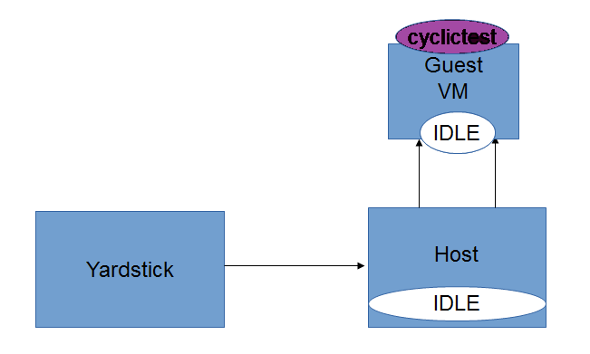
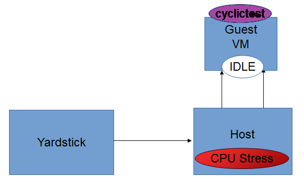
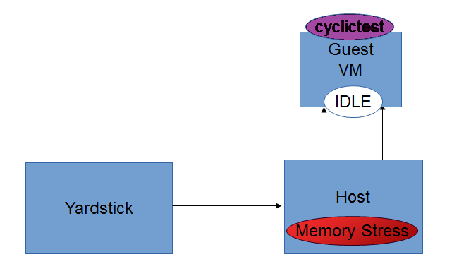
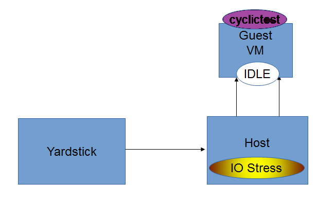
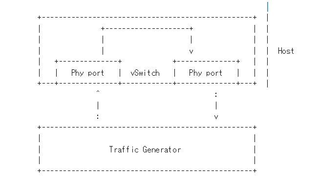
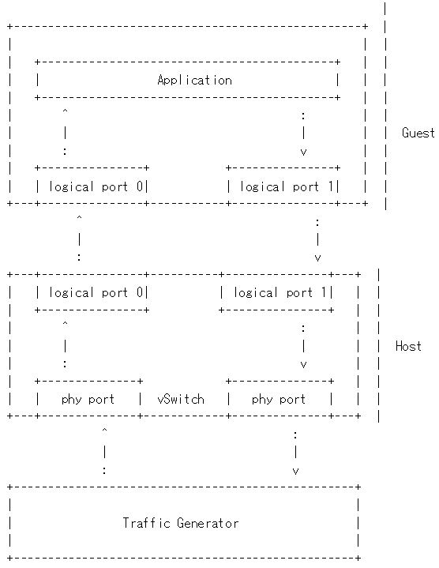
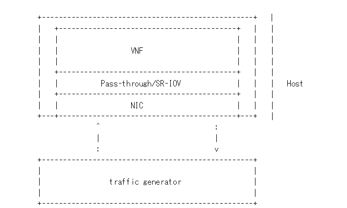

.. This work is licensed under a Creative Commons Attribution 4.0 International License.

.. http://creativecommons.org/licenses/by/4.0

Low Latency Environment
=======================

Achieving low latency with the KVM4NFV project requires setting up a special
test environment. This environment includes the BIOS settings, kernel
configuration, kernel parameters and the run-time environment.

Hardware Environment Description
--------------------------------

BIOS setup plays an important role in achieving real-time latency. A collection
of relevant settings, used on the platform where the baseline performance data
was collected, is detailed below:

CPU Features
~~~~~~~~~~~~

Some special CPU features like TSC-deadline timer, invariant TSC and Process
posted interrupts, etc, are helpful for latency reduction.

CPU Topology
~~~~~~~~~~~~

NUMA topology is also important for latency reduction.

BIOS Setup
~~~~~~~~~~

Careful BIOS setup is important in achieving real time latency. Different
platforms have different BIOS setups, below are the important BIOS settings on
the platform used to collect the baseline performance data.

Software Environment Setup
--------------------------
Both the host and the guest environment need to be configured properly to
reduce latency variations.  Below are some suggested kernel configurations.
The ci/envs/ directory gives detailed implementation on how to setup the
environment.

Kernel Parameter
~~~~~~~~~~~~~~~~

Please check the default kernel configuration in the source code at:
kernel/arch/x86/configs/opnfv.config.

Below is host kernel boot line example:

.. code:: bash

   isolcpus=11-15,31-35 nohz_full=11-15,31-35 rcu_nocbs=11-15,31-35
   iommu=pt intel_iommu=on default_hugepagesz=1G hugepagesz=1G mce=off idle=poll
   intel_pstate=disable processor.max_cstate=1 pcie_asmp=off tsc=reliable

Below is guest kernel boot line example

.. code:: bash

   isolcpus=1 nohz_full=1 rcu_nocbs=1 mce=off idle=poll default_hugepagesz=1G
   hugepagesz=1G

Please refer to `tuning.userguide` for more explanation.

Run-time Environment Setup
~~~~~~~~~~~~~~~~~~~~~~~~~~

Not only are special kernel parameters needed but a special run-time
environment is also required. Please refer to `tunning.userguide` for
more explanation.

Test cases to measure Latency
-----------------------------
The performance of the kvm4nfv is assesed by the latency values. Cyclictest and Packet forwarding
Test cases result in real time latency values of average, minimum and maximum.

* Cyclictest

* Packet Forwarding test

1. Cyclictest case
-------------------
Cyclictest results are the most frequently cited real-time Linux metric. The core concept of Cyclictest is very simple.
In KVM4NFV cyclictest is implemented on the Guest-VM with 4.4-Kernel RPM installed. It generated Max,Min and Avg
values which help in assesing the kernel used. Cyclictest in currently divided into the following test types,

* Idle-Idle
* CPU_stress-Idle
* Memory_stress-Idle
* IO_stress-Idle

Future scope of work may include the below test-types,

* CPU_stress-CPU_stress
* Memory_stress-Memory_stress
* IO_stress-IO_stress

Understanding the naming convention
~~~~~~~~~~~~~~~~~~~~~~~~~~~~~~~~~~~

.. code:: bash

   [Host-Type ] - [Guest-Type]

* **Host-Type  :** Mentions the type of stress applied on the kernel of the Host
* **Guest-Type :** Mentions the type of stress applied on the kernel of the Guest

Example.,

.. code:: bash

    Idle - CPU_stress

The above name signifies that,

- No Stress is applied on the Host kernel

- CPU Stress is applied on the Guest kernel

**Note:**

- Stress is applied using the stress which is installed as part of the deployment.
  Stress can be applied on CPU, Memory and Input-Output (Read/Write) operations using the stress tool.

Version Features
~~~~~~~~~~~~~~~~

+-----------------------+------------------+-----------------+
| **Test Name**         | **Colorado**     | **Danube**      |
|                       |                  |                 |
+-----------------------+------------------+-----------------+
| - Idle - Idle         |     ``Y``        |     ``Y``       |
|                       |                  |                 |
| - Cpustress - Idle    |                  |     ``Y``       |
|                       |                  |                 |
| - Memorystress - Idle |                  |     ``Y``       |
|                       |                  |                 |
| - IOstress - Idle     |                  |     ``Y``       |
|                       |                  |                 |
+-----------------------+------------------+-----------------+

Idle-Idle test-type
~~~~~~~~~~~~~~~~~~~
Cyclictest in run on the Guest VM when Host,Guest are not under any kind of stress. This is the basic
cyclictest of the KVM4NFV project. Outputs Avg, Min and Max latency values.

CPU_Stress-Idle test-type
~~~~~~~~~~~~~~~~~~~~~~~~~
Here, the host is under CPU stress, where multiple times sqrt() function is called on kernel which
results increased CPU load. The cyclictest will run on the guest, where the guest is under no stress.
Outputs Avg, Min and Max latency values.

Memory_Stress-Idle test-type
~~~~~~~~~~~~~~~~~~~~~~~~~~~~
In this type, the host is under memory stress where continuos memory operations are implemented to
increase the Memory stress (Buffer stress).The cyclictest will run on the guest, where the guest is under
no stress. It outputs Avg, Min and Max latency values.

IO_Stress-Idle test-type
~~~~~~~~~~~~~~~~~~~~~~~~
The host is under constant Input/Output stress .i.e., multiple read-write operations are invoked to
increase stress. Cyclictest will run on the guest VM that is launched on the same host, where the guest
is under no stress. It outputs Avg, Min and Max latency values.

CPU_Stress-CPU_Stress test-type
~~~~~~~~~~~~~~~~~~~~~~~~~~~~~~~
Not implemented for Danube release.

Memory_Stress-Memory_Stress test-type
~~~~~~~~~~~~~~~~~~~~~~~~~~~~~~~~~~~~~
Not implemented for Danube release.

IO_Stress-IO_Stress test type
~~~~~~~~~~~~~~~~~~~~~~~~~~~~~
Not implemented for Danube release.

2. Packet Forwarding Test cases
-------------------------------
Packet forwarding is an other test case of Kvm4nfv. It measures the time taken by a packet to return
to source after reaching its destination. This test case uses automated test-framework provided by
OPNFV VSWITCHPERF project and a traffic generator (IXIA is used for kvm4nfv). Only latency results
generating test cases are triggered as a part of kvm4nfv daily job.

Latency test measures the time required for a frame to travel from the originating device through the
network to the destination device. Please note that RFC2544 Latency measurement will be superseded with
a measurement of average latency over all successfully transferred packets or frames.

Packet forwarding test cases currently supports the following test types:

* Packet forwarding to Host

* Packet forwarding to Guest

* Packet forwarding to Guest using SRIOV

The testing approach adoped is black box testing, meaning the test inputs can be generated and the
outputs captured and completely evaluated from the outside of the System Under Test(SUT).

Packet forwarding to Host
~~~~~~~~~~~~~~~~~~~~~~~~~
This is also known as Physical port → vSwitch → physical port deployment.
This test measures the time taken by the packet/frame generated by traffic generator(phy) to travel
through the network to the destination device(phy). This test results min,avg and max latency values.
This value signifies the performance of the installed kernel.

Packet flow,

Packet forwarding to Guest
~~~~~~~~~~~~~~~~~~~~~~~~~~
This is also known as Physical port → vSwitch → VNF → vSwitch → physical port deployment.

This test measures the time taken by the packet/frame generated by traffic generator(phy) to travel
through the network involving a guest to the destination device(phy). This test results min,avg and
max latency values. This value signifies the performance of the installed kernel.

Packet flow,

Packet forwarding to Guest using SRIOV
~~~~~~~~~~~~~~~~~~~~~~~~~~~~~~~~~~~~~~
This test is used to verify the VNF and measure the base performance (maximum forwarding rate in
fps and latency) that can be achieved by the VNF without a vSwitch. The performance metrics
collected by this test will serve as a key comparison point for NIC passthrough technologies and
vSwitches. VNF in this context refers to the hypervisor and the VM.

**Note:** The Vsperf running on the host is still required.

Packet flow,

